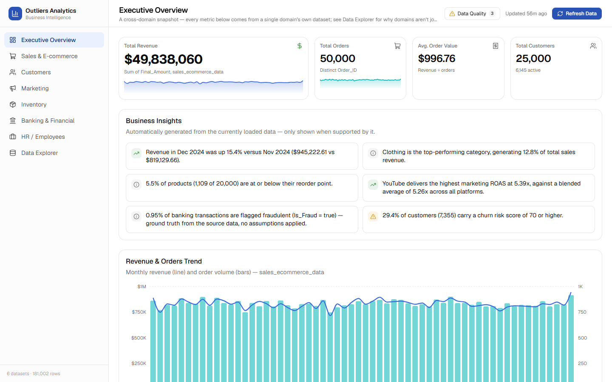
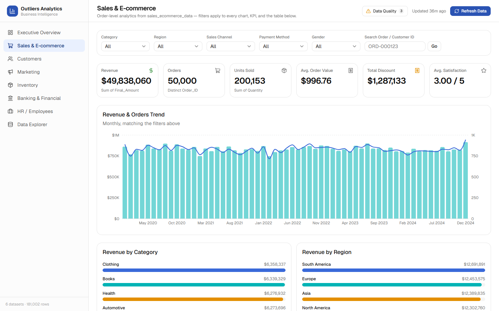
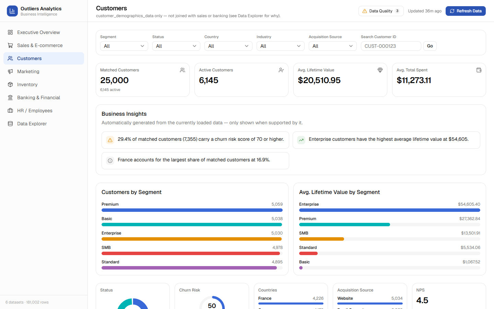
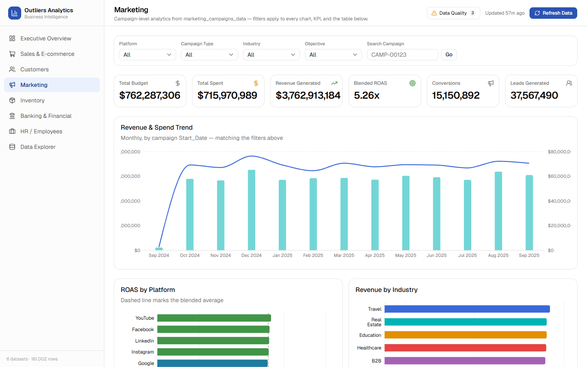
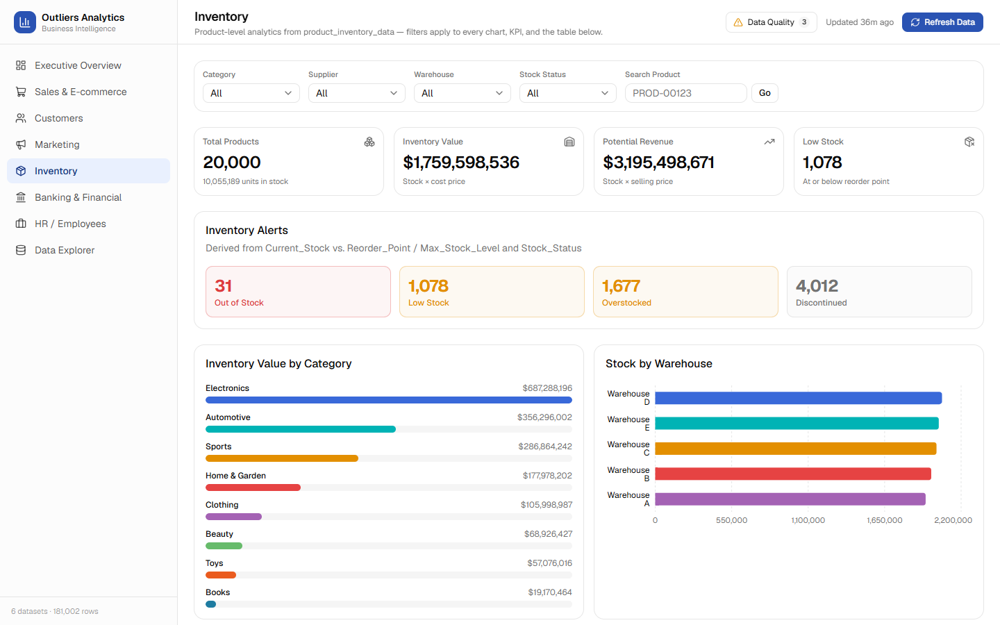
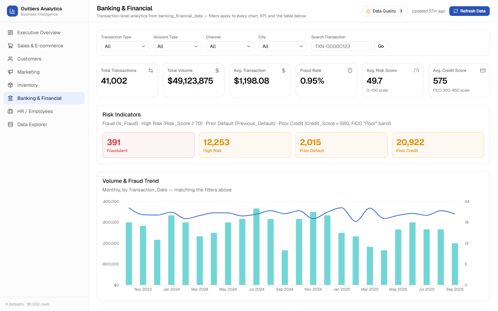
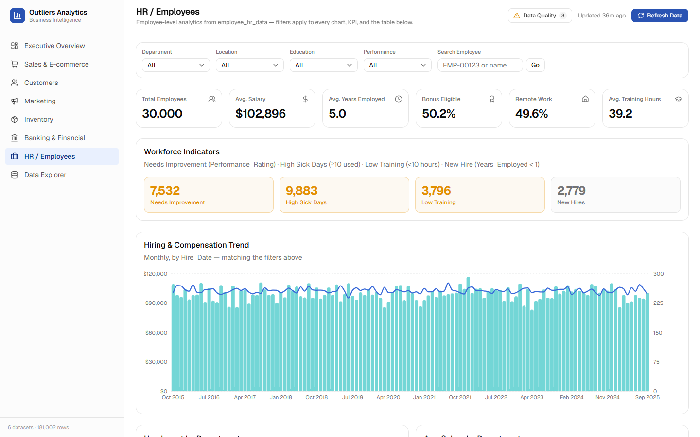
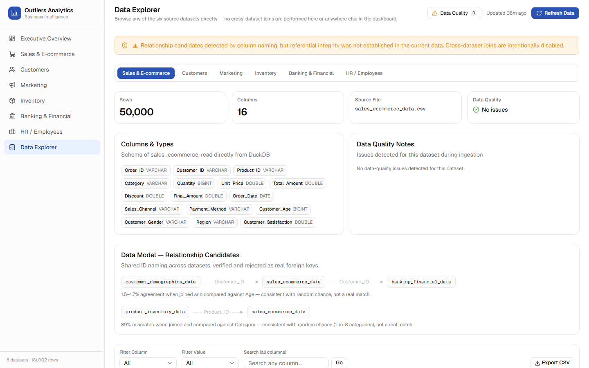

# Outliers Analytics

A full-stack BI dashboard over six independent business datasets — Sales & E-commerce, Customers, Marketing, Inventory, Banking & Financial, and HR — built with Next.js, DuckDB, and Recharts. Every metric is computed server-side from the source CSVs; nothing is hardcoded on the frontend.

**Live demo:** https://analytics-dashboard-phi-kohl.vercel.app

## Architecture

```
CSV files → Ingestion/validation → DuckDB (in-memory) → SQL aggregation → API routes → React UI
```

- **Next.js 16 (App Router) + TypeScript** — pages under `src/app/`, API routes under `src/app/api/`.
- **DuckDB** (`@duckdb/node-api`) — all analytical queries run in SQL against an in-memory DuckDB instance loaded from the CSVs at startup.
- **Recharts + shadcn/ui (base-ui) + Tailwind CSS v4** — charts and components, themed via CSS variables.
- **Automatic refresh** — a manual "Refresh Data" button plus a 30s poll detect source-file changes (mtime/size) and re-ingest only when something actually changed.

### No cross-dataset joins

Three datasets share a `Customer_ID`-shaped column and two share a `Product_ID`-shaped column, which looks like a foreign-key relationship. It isn't: joining on Customer_ID and comparing Age agrees only 1.5–1.7% of the time across every pair (random-chance level), and joining on Product_ID and comparing Category mismatches 89% of the time. These are independently-generated synthetic ID pools that happen to share a numeric range and string format.

Every page in this app is built on exactly one dataset. The **Data Explorer** documents this naming coincidence as a relationship diagram, explicitly labeled as unverified — see [`docs/adr/0001-no-cross-dataset-joins.md`](docs/adr/0001-no-cross-dataset-joins.md) for the full write-up and match-rate evidence.

## Pages

| Page | Source dataset |
|---|---|
| Executive Overview | all six, reported per-domain (no blended metrics) |
| Sales & E-commerce | `sales_ecommerce_data` |
| Customers | `customer_demographics_data` |
| Marketing | `marketing_campaigns_data` |
| Inventory | `product_inventory_data` |
| Banking & Financial | `banking_financial_data` |
| HR / Employees | `employee_hr_data` |
| Data Explorer | all six, browsed independently — search, filter, sort, paginate, export CSV |

## Screenshots

### Executive Overview


### Sales & E-commerce


### Customers


### Marketing


### Inventory


### Banking & Financial


### HR / Employees


### Data Explorer


## Getting started

```bash
npm install
npm run dev
```

Open [http://localhost:3000](http://localhost:3000). The six source CSVs in the project root are ingested into DuckDB automatically on first request.

```bash
npm run lint    # ESLint
npm run build   # production build
```

## Project docs

- [`CONTEXT.md`](CONTEXT.md) — data model glossary (Domain, Scoped identifier, Relationship candidate, Snapshot field) and dataset grain/row counts.
- [`docs/adr/0001-no-cross-dataset-joins.md`](docs/adr/0001-no-cross-dataset-joins.md) — the architectural decision record behind the no-joins rule.
